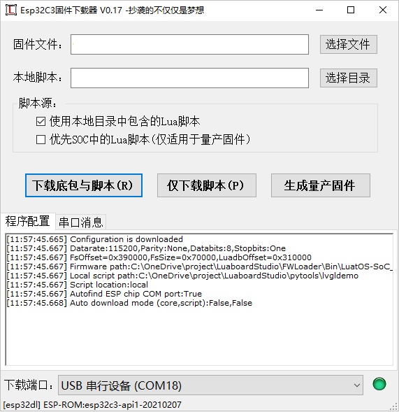
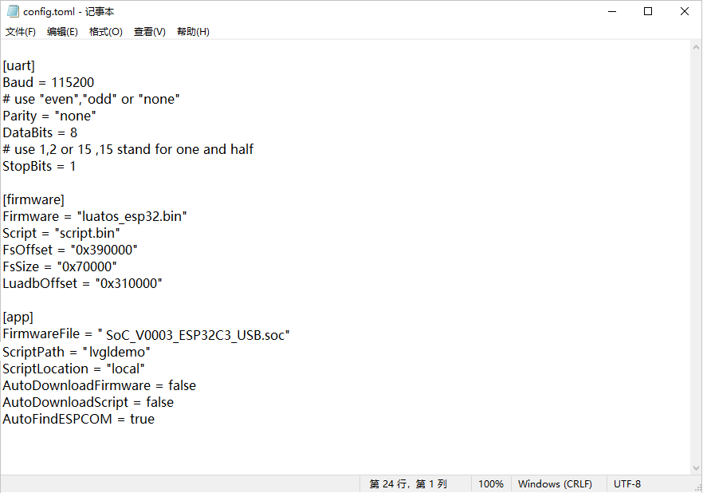

# ESP32 固件下载器

## 功能简介

ESP32C3 固件下载器是一个使用C#语言为ESP32-C3芯片定制的固件下载器，能够全自动的对Esp32-C3系列芯片完成从硬件插入到固件烧写的全过程操作且无需人工干预，烧录完成后通过简明的颜色方式输出烧写结果。除标准的乐鑫公司的bin固件，本软件还支持烧写上海合宙出品的LuatoS主板专属SOC格式的固件及基于Luat技术的Lua嵌入式脚本等功能。

ESP32C3 固件下载器现支持如下功能：

1. 图形化方式 烧写SOC，Bin格式的固件及目录化的Lua脚本源文件。
2. 自动对Lua源文件进行混淆化处理，增强代码安全性。
3. 自动串口插入识别，并自动侦测插入设备类型。
4. 支持USB及串口两种方式的Esp32-C3的固件烧写。
5. 可选支持上电自动烧写功能，实现全自动烧写。
6. 支持将Lua脚本打包成SOC格式的量产固件，方便进行生产分发。
7. 支持采用命令行方式完成以上功能，提供独立使用的命令行可执行程序esp32dl.exe
8. 烧写完成后显示是否烧录成功，如果成功，状态栏变为"绿色"，失败则变为"红色"。
## 使用方法

### 图形化方式使用

图形化界面基本属于傻瓜式设计，介绍显得多余。基本就是选择要烧录的SOC\bin文件，并选择要烧录的脚本目录，然后插入硬件点击下载即可。 对于SOC格式的固件，本身支持内置脚本，因此可以通过更改脚本源选择内置脚本。

如果您有自动化烧录需求，可以使用记事本打开程序目录中的“config.toml”文件，对相应配置字段进行修改。

字段用途定义如下：

* FirmwareFile 固件的绝对地址
* ScriptPath  脚本目录
* ScriptLocation 脚本源，可以是local或package
* AutoDownloadFirmware 自动下载固件，设置为true则自动下载soc固件
* AutoDownloadScript 自动下载脚本，设置为true则自动下载脚本目录
* AutoFindESPCOM 自动识别接入了esp设备的串口，设置为true则自动切换当前串口为esp设备接入的串口

### 命令行方式使用

如果您想把下载器集成在您自己的系统里，可以使用命令行方式进行烧录，命令参数如下：

	"ESP32 Downloader"

	   -v或者--version	Show version
	   -t或者--target	Chip型号:esp32c3,esp32s3  
	   -f或者--fs    	下载脚本  
	   -r或者--rom  	下载底层固件  
	   -p或者--pkg     	下载文件的格式为SOC  

	   -c或者--com 	下载串口  
	   -b或者--bandrate 	波特率  
	   -l或者--load 	固件文件名称  
	   -s或者--script 	脚本文件夹名称 
	   -m或者--make	将soc文件与外部脚本重新打包为新的soc

	   --FsOffset  	FsOffset，固定设置  
	   --FsSize  	FsSize  ，固定设置  
	   --LuadbOffset 	LuadbOffset，固定设置  

	   --usb     	usb通讯  
	   --uart     	uart通讯

比如您想完整的烧录SOC固件和脚本，固件名称为 "LuatOS-SoC_V0003_ESP32C3_USB.soc"，存放路径与烧写器同目录，Lua脚本内置于SOC文件中，esp32-c3芯片与电脑通过USB方式连接，CDC串口名称为"COM18"，则可以用如下控制台命令开始烧录:

	esp32dl -p -t esp32c3 -rf -c COM18 -b 921600 -l LuatOS-SoC_V0003_ESP32C3_USB.soc --FsOffset 0x390000 --FsSize 0x70000 --LuadbOffset 0x310000 --usb

## 代码设计

ESP32C3 固件下载器 底层基于乐鑫公司开源的固件下载脚本源码，梦程大佬对其根据LuatOS固件格式又进行了二次封装。笔者对梦程大佬的源码进行了可执行化包装，生成了命令行可执行程序esp32dl.exe

源码地址如下：https://gitee.com/dreamcmi/LuatOS-ESP32/tree/master/tools

在esp32dl.exe基础上，笔者又开发了图形UI的控制外壳，该外壳主要实现了串口的插入检测，及设备类型的判断。通过控制USB转串口芯片的CTS、RTS两个应答控制线（对于USB烧录方式、乐鑫亦在芯片内部通过软件的方式实现了虚拟化的CTS、RTS引线）对c3芯片实现上电复位，并根据上电信息判断芯片类型。当接入的电路为esp32-c3系列的情况，激活下载功能。并交由用户进行烧写工作。

其中设备的接入检测部分无耻的抄袭了晨旭大神的LLCOM的USB串口检测部分（连注释都抄了），他的这种检测方式可以使本软件在Windows环境下迅速可靠地检测到串口类型设备的插入及移除动作，串口通讯部分由于不涉及高速通讯则使用了原生的.Net对象 "SerialPort"，并进行了相当简单的封装，并单独写在 "uart.CS"文件中

源文件目录结构如下：

* FWLoader
	* /FWLoader - C#项目文件
		* /FWLoader/Form1.cs - 主窗体
		* /FWLoader/Uart.CS - 串口封装代码，处理串口的打开关闭及善后清理工作
	* /bin 可执行二进制程序的存放目录
		* /bin/esp32dl.exe 封装后的可执行命令行程序
	
其中esp32dl.exe的源码大体上完整的抄袭了梦程大佬的"LuatOS-Esp32 tool"源码，为了防止他对我这种公然地盗窃行为进行打击，我就不再重复开源了。 如果您有使用源码进行二次开发的需要，可以直接参考上面公布的源码地址。

整体来说本程序开发难度较低，源代码中对于各个函数的功能也进行了详细的注解，在次就不再多敷述了，期待您的阅读与使用，有任何问题也欢迎随时与我取得联系。